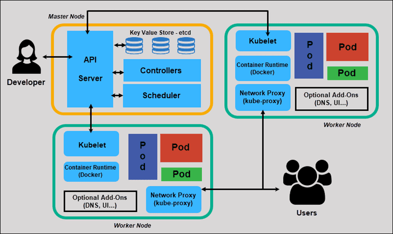

# Réseau : intro

Maintenant que l'on a réussi à déployer un pod, on aimerait bien pouvoir y accéder niveau réseau.  
Afin de pouvoir y accéder, il faut comprendre ce qu'il se passe niveau réseau.  

## Rappel : architecture

  

Votre pod tourne donc quelque part, sur un des noeuds workers.  

## Pour le débug : port-forward  

Dans la suite, on va décortiquer le réseau et, dans les chapitres suivants, voir comment on peut exposer notre pod à l'intérieur et à l'extérieur du cluster.  
Mais, quand on veut simplement tester la connectivité du pod, il existe une commande très utile qui créé un **tunnel temporaire direct** entre votre machine (celle qui exécute la commande `kubectl`) et le pod en passant par l'APIServer.  
Cette commande ne doit servir que pour du débug ou du testing, pas en production ! On verra dans les chapitres suivants des façons propres et stables d'exposer nos applications.  

On récupère le nom du pod :  
```
gon@laboitemagique:~$ kubectl get pods
NAME                             READY   STATUS    RESTARTS   AGE
nginx-627544-5cc45d7bd6-nsxvz   1/1     Running   0          6d21h
```

On créé le tunnel temporaire : 
```
gon@laboitemagique:~$ kubectl port-forward nginx-627544-5cc45d7bd6-nsxvz 9000:8080  
Forwarding from 127.0.0.1:9000 -> 8080
Forwarding from [::1]:9000 -> 8080
```  
tant que cette commande est active, tous les flux vers `localhost:9000` seront transmis (via l'APIServer) directement au pod sur le port `8080`.  

**Cette commande est bien pratique pour le débug / testing mais n'est pas un moyen stable d'exposer une application.**

## Réseau des pods  

On l'a vu, la conteneurisation vise à isoler entièrement les processus. Il y a donc une isolation de tous les aspects du processus (système de fichiers, mémoire ...) et donc une isolation du réseau.  
Pour cela, les moteurs de conteneurisation crééent en général un réseau virtuel dans lequel vont évoluer les différents conteneurs.  
En Kubernetes, **chaque pod possède sa propre IP** dans le réseau des pods.  
Ce mécanisme (CNI : Container Network Interface) est délégué à un provider CNI dont il existe de nombreuses implémentations. Le plus connu est probablement [calico](https://github.com/projectcalico/calico) mais on peut aussi citer Canal, Weave, Flannel, Cilium ...  
Le rôle du CNI provider est de créer et maintenir le réseau privé des pods et d'allouer dynamiquement une IP à chaque pod qui se créé.

## IP d'un pod

Pour obtenir l'IP d'un pod, on peut par exemple utiliser la commande `kubectl get pods -o wide`.  
Exemple :  
```
gon@laboitemagique:~$ kubectl get pods -o wide
NAME                             READY   STATUS        RESTARTS   AGE    IP              NODE     NOMINATED NODE   READINESS GATES
nginx-627544-5cc45d7bd6-nsxvz   1/1     Running       0          6d8h   10.233.112.84   boss4    <none>           <none>
```  

Ici, mon pod a l'IP `10.233.112.84`.  
Attention, cette IP n'est pas statique ! Elle n'est "allouée" au pod que pendant la durée de sa vie.  
Une fois qu'un pod meurt, son IP retourne dans le pool des IP disponibles et peut même être réallouée à un autre pod complètement différent ultérieurement.  
Vous pouvez en faire l'expérience en supprimant manuellement le pod `kubectl delete pod nginx-627544-5cc45d7bd6-nsxvz`


